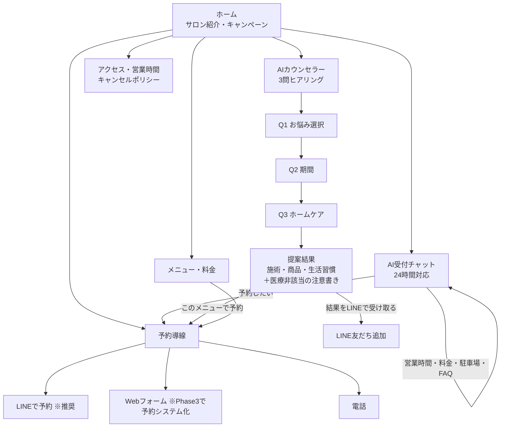
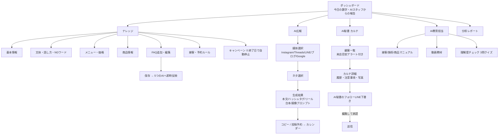

# 画面遷移図

プロトタイプ（`../index.html`）に実装済みの画面と、その遷移をまとめます。
原則：**どの画面からも目的の操作まで3タップ以内**。

## お客様側（ゲストアプリ）

**設計ポイント**

- 最重要KPIは「相談 → LINE登録」「受付 → 予約導線」の2つ。両導線をすべての終端に置く
- AIカウンセラーは自由入力ではなく**選択式3問**。40〜60代のお客様でも迷わず、
  回答の質も安定する（自由入力はPhase 2でハイブリッド化）
- 提案結果には必ず「医療的な診断ではありません」の免責を常設

## オーナー側（管理アプリ）

**設計ポイント**

- ダッシュボードは「数字」より先に**AIスタッフからの報告**（何が起きたか、何をすべきか）を
  日本語の文章で見せる。オーナーは分析画面を開かなくても意思決定できる
- ナレッジ保存時は必ず「5つのAIに反映されました」とフィードバックし、
  「1か所直せば全部に効く」というメンタルモデルを育てる
- AIが対外的に送るもの（LINE・SNS）は必ず**下書き → オーナー承認**を挟む

## 3タップ検証（代表フロー）

| やりたいこと | タップ数 |
|---|---|
| お客様：予約手段にたどり着く | ホーム → 予約 → LINE（**2**） |
| お客様：カウンセリング完了 | AI相談 → 3問（**4** ※質問自体が価値のため許容） |
| オーナー：Instagram投稿を作る | 広報 → ネタ選択 → 生成（**3**） |
| オーナー：FAQを追加する | ナレッジ → FAQ → 保存（**3**） |
| オーナー：フォローLINEを送る | カルテ → 顧客 → 送る（**3**） |
