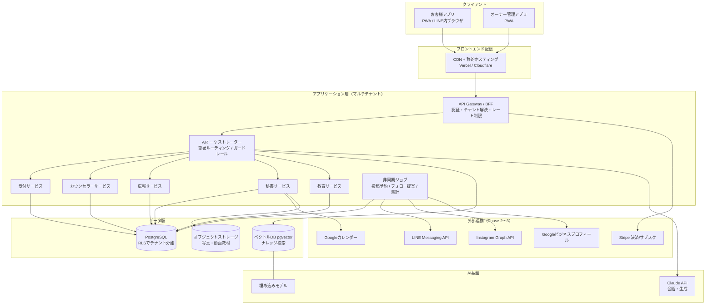

# システム構成・SaaSアーキテクチャ

## 全体構成図



## AIオーケストレーターの責務

すべてのAI呼び出しは1本のオーケストレーターを通します。ここが品質と安全の要です。

1. **テナント解決**：リクエストから `tenant_id` を確定し、そのサロンのナレッジだけを読む
2. **コンテキスト組み立て**：`システム方針 → 業種プリセット → サロンナレッジ → 部署ロール → 会話履歴` の順でプロンプトを構成（詳細は `04_ai_knowledge.md`）
3. **ガードレール**：
   - 薬機法・医療広告ガイドライン用の禁止表現チェック（生成後の後段フィルタ）
   - サロンごとのNGワードチェック
   - 対外送信（LINE/SNS）は必ず `draft` 状態で保存し、オーナー承認後にのみ送信
4. **ログ**：全会話・全生成を `conversations` に記録（分析・改善・監査の元データ）

## SaaS化を見据えた判断

| 論点 | 判断 | 理由 |
|---|---|---|
| テナント分離 | **共有DB + Row Level Security（`tenant_id`）** | 個人サロン単価でDB per tenantはコスト過剰。RLSで漏えいをDB層で防ぐ |
| フロント | **1つのアプリを設定で着せ替え**（テーマトークン＋ナレッジ） | テンプレート販売＝「コード共通・データ差し替え」を成立させる |
| 課金 | Stripe Billing（月額サブスク3プラン想定：受付のみ / 標準 / 全部署） | 部署単位で機能フラグを切る設計にし、プラン＝有効な部署の集合にする |
| AIコスト管理 | テナント別のトークン集計＋月間上限 | 原価が読めないとSaaS価格が決められない。上限超過は低コストモデルへ縮退 |
| 独自ドメイン | Phase 2でカスタムドメイン対応 | 「自分のサロンのサイト」感がテンプレート販売の訴求点になる |
| 多店舗・権限 | `tenant → store → staff(role)` の3階層を最初からID設計に含める | 後付けのマルチ店舗化はデータ移行が最も高くつく |

## テンプレート販売の設計思想

**原則：サロン固有情報をコードに1文字も書かない。**

```
配布物 = 共通コード（全サロン同一）
        + 業種プリセット（エステ/美容室/ネイル/整体… の初期ナレッジ＋質問セット）
        + テーマトークン（色・書体・角丸などのCSS変数）
```

- 導入フロー：業種を選ぶ → 15分のセットアップウィザード（サロン名・営業時間・メニュー・文体サンプル）→ その場でAI受付が自サロンの言葉で答え始める
- 販売形態の段階：
  1. **テンプレート販売**（買い切り・セットアップ代行）
  2. **SaaS**（月額・自動アップデート）
  3. **ライセンス販売**（制作会社・コンサルへ業種プリセットごと卸す。ホワイトラベル）
- どの形態でも中身は同じコードベース。差はデプロイ方法と課金だけにする

## Phase 1（MVP）の最小構成

MVPはこの図の全部を作りません。

```
静的フロント（本プロトタイプの構造そのまま）
 + 薄いAPI（認証・ナレッジCRUD・チャット1エンドポイント）
 + PostgreSQL（pgvector拡張・RLS）
 + Claude API
 + LINE公式アカウントへのリンク導線（APIはまだ使わない）
```

予約・決済・SNS APIはPhase 3。**まず「ナレッジ→AI応答」の縦串を1本通す**のが最優先です。
