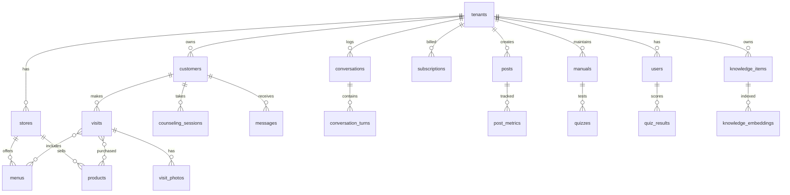

# データベース設計

PostgreSQL（＋pgvector）。全テーブルに `tenant_id` を持たせ、Row Level Securityで分離します。
`id` はULID、時刻は `timestamptz`、削除は論理削除（`deleted_at`）が基本です。

## ER図

## 主要テーブル

### テナント・アカウント

| テーブル | 主な列 | 補足 |
|---|---|---|
| `tenants` | id, name, industry(エステ/美容室/ネイル…), plan, theme_tokens(jsonb), status | 1契約=1テナント |
| `stores` | id, tenant_id, name, address, hours(jsonb), parking, holidays | 多店舗はここで増える |
| `users` | id, tenant_id, role(owner/staff), name, email, line_user_id | スタッフ権限はrole拡張で対応 |
| `subscriptions` | id, tenant_id, stripe_customer_id, plan, token_budget, current_usage | AIコスト上限もここ |

### ナレッジ（詳細は `04_ai_knowledge.md`）

| テーブル | 主な列 | 補足 |
|---|---|---|
| `knowledge_items` | id, tenant_id, category, key, content(jsonb), scope(部署配列), priority, valid_from, valid_until, version, updated_by | **本システムの心臓部**。キャンペーンは `valid_until` で自動失効 |
| `knowledge_embeddings` | id, knowledge_item_id, chunk_text, embedding(vector) | 保存トリガで再生成 → 全AIへ即時反映 |

### 顧客・カルテ（AI秘書）

| テーブル | 主な列 | 補足 |
|---|---|---|
| `customers` | id, tenant_id, name, kana, line_user_id, skin_type, tags(text[]), cautions(注意事項), visit_cycle_days, next_visit_due | `next_visit_due` がフォロー提案の起点 |
| `visits` | id, customer_id, visited_at, staff_id, note, total_amount | |
| `visit_menus` / `visit_products` | visit_id, menu_id/product_id, price | 施術履歴・販売履歴 |
| `visit_photos` | id, visit_id, object_key, taken_at, consent(boolean) | 写真は同意フラグ必須 |
| `messages` | id, customer_id, channel(line/mail), direction, body, status(draft/approved/sent), created_by(ai/human) | **AI生成は必ずdraftから** |

### 会話ログ（AI受付・カウンセラー）

| テーブル | 主な列 | 補足 |
|---|---|---|
| `conversations` | id, tenant_id, dept(reception/counselor), customer_id?, channel, started_at | 匿名会話は customer_id NULL |
| `conversation_turns` | id, conversation_id, role(user/ai), content, used_knowledge_ids(ulid[]), tokens | どのナレッジを根拠に答えたかを記録（監査・改善用） |
| `counseling_sessions` | id, conversation_id, concerns(text[]), duration, homecare_level, recommended_menu_id, recommended_product_id, outcome(line登録/予約/離脱) | 分析画面の元データ |

### マーケティング（AI広報）

| テーブル | 主な列 | 補足 |
|---|---|---|
| `posts` | id, tenant_id, media(instagram/threads/line/blog/gbp), topic, body, hashtags, reel_script, image_prompt, status(draft/scheduled/published), scheduled_at | 投稿カレンダー＝このテーブルのビュー |
| `post_metrics` | id, post_id, impressions, saves, clicks, fetched_at | Phase 3でAPI自動取得、Phase 2は手入力 |
| `content_ideas` | id, tenant_id, title, note, source(ai/owner), used | ネタ帳 |

### 教育（AI教育担当）

| テーブル | 主な列 | 補足 |
|---|---|---|
| `manuals` | id, tenant_id, kind(接客/施術/商品), title, body, video_object_key | マニュアル本文もナレッジ検索対象 |
| `quizzes` | id, manual_id, question, options(jsonb), answer_index, explanation | AIがマニュアルから自動生成 |
| `quiz_results` | id, quiz_id, user_id, correct, answered_at | 理解度チェックの記録 |

## 設計上の重要ルール

1. **RLS必須**：`create policy tenant_isolation on <table> using (tenant_id = current_setting('app.tenant_id')::text);` を全テーブルに。アプリのバグでも他サロンのデータは読めない
2. **個人情報の最小化**：お客様アプリは匿名で使い始められる（customer_id なしの会話）。カルテ化はLINE連携 or 来店時に初めて行う
3. **写真・カルテは要配慮情報として扱う**：オブジェクトストレージは署名付きURL、閲覧ログを残す
4. **AIの出力には出所を残す**：`used_knowledge_ids` により「なぜAIがそう答えたか」を追跡でき、誤答時はナレッジ修正で直せる
