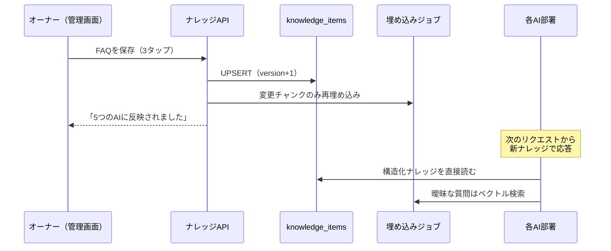

# AIナレッジ構造 — 本システム最大の特徴

AIは毎回ゼロから考えません。サロンの知識を1か所に集約し、
**5つのAI部署すべてが同じナレッジを参照**します。1回の更新が全AIに効きます。

## ナレッジのカテゴリ構造

```
knowledge/
├── identity        … サロンの人格
│   ├── コンセプト / 理念
│   ├── オーナー紹介
│   ├── 文体・話し方（語尾・敬語レベル・絵文字の使い方）
│   ├── よく使う言葉（「お肌」「ご褒美時間」…）
│   └── NGワード（「治る」「シミが消える」「激安」…）
├── offerings       … 提供するもの
│   ├── メニュー（名称・説明・時間・税込価格）
│   ├── 商品（特徴・価格・おすすめ対象・在庫）
│   └── キャンペーン（内容・期間 → 終了日で自動失効）
├── operations      … 店の決まりごと
│   ├── 営業時間・定休日・アクセス・駐車場
│   ├── 予約ルール / キャンセルポリシー
│   ├── 接客ルール（お出迎え・お見送り・呼び方）
│   └── 配信ルール（LINEの頻度・Instagramのトーン）
├── faq             … よくある質問と答え
└── counseling      … カウンセリング知識
    ├── 業種プリセット質問（悩み選択肢・deep質問）
    ├── 悩み → 施術・商品・生活習慣のマッピング
    └── 免責文・受診案内の定型文
```

## データ表現（`knowledge_items` の例）

```json
{
  "id": "01J...",
  "tenant_id": "t_chainonjoli",
  "category": "identity.tone",
  "key": "writing_style",
  "content": {
    "voice": "丁寧だが距離が近い。押し売りしない。",
    "sentence_end": ["〜ですね", "〜してみてくださいね"],
    "emoji_policy": "1メッセージに1〜2個まで。🌸☺️🌿を優先",
    "ng_words": ["治る", "消える", "医学的に", "絶対", "激安"]
  },
  "scope": ["reception", "counselor", "marketing", "secretary", "education"],
  "priority": 10,
  "valid_from": null,
  "valid_until": null,
  "version": 4
}
```

- `scope`：どの部署がこのナレッジを使うか。既定は全部署
- `valid_until`：キャンペーン情報の自動失効に使う（「終わったセールを案内し続けるAI」を構造的に防ぐ）
- `version`：更新履歴を保持。誤更新のロールバックが1タップでできる

## 「更新すると全AIに反映」の仕組み



ポイント：AI側はナレッジを**キャッシュせず毎回読む**（または短TTL）。
「保存したのに反映されない」という40〜60代オーナーの信頼を損なう事象を仕組みで排除します。

## プロンプト組み立て（オーケストレーター）

各部署のリクエストごとに、次の順で文脈を積みます。上にあるものほど優先です。

```
1. システム方針（全テナント共通・変更不可）
   - 医療行為をしない / 診断・断定をしない / 個人情報を聞き出さない
   - 対外送信文は必ず draft として返す
2. 業種プリセット（エステ / 美容室 / ネイル / 整体 …）
   - 業種特有の禁忌・定番質問・専門用語辞書
3. サロンナレッジ（構造化分＝identity / operations は全文注入）
4. 関連ナレッジ（faq / offerings / counseling からベクトル検索で上位k件）
5. 部署ロール（あなたはAI受付です… 等）
6. 会話履歴・当日の文脈（キャンペーン有効判定済み）
```

**ガードレール（生成後チェック）**：NGワード・薬機法表現・価格の齟齬（ナレッジ上の価格と
数字が一致するか）を後段で機械チェックし、違反時は再生成します。

## 業種プリセット＝テンプレート販売の単位

| プリセット | カウンセラーの質問例 | 特有の注意 |
|---|---|---|
| エステ | 肌悩み（シミ/シワ/毛穴/乾燥…） | 薬機法・医療広告 |
| 美容室 | 髪質・骨格・なりたい印象 | パーソナルカラー断定を避ける |
| ネイル | 爪の状態・生活シーン・持ち | 巻き爪等は医療案内へ |
| アイラッシュ | 目の形・普段のメイク | パッチテスト案内 |
| 整体 | 不調部位・生活習慣・痛みの度合い | **症状断定禁止・受診案内を強化** |
| リラクゼーション | 疲れの種類・強さの好み | 治療効果を謳わない |

プリセットは「初期ナレッジ一式＋質問セット＋NGワード集」のパッケージであり、
コードの分岐ではありません。新業種の追加＝データ追加だけで完了します。
